# Self-Driving Car Engineer Nanodegree Writeup

___author___: Dan R. Mbanga

___project___: Finding Lane Lines on the Road

---

## I. Introduction

The goal of this exercise is to find the lane lines on the road, given camera images. This writeup highligts my thought process and approach to solving the challenges. I build a pipeline of image transformation and plotting as both a practice exercise and a mechanism to visualize and internalize the image transformation process. This process got me learning the specifics of different image transformation methods: grayscale, kernel convolution, edge detection, masking a region of interest, hough transformation to find shapes, and overlay of these shapes on the original image.


Original Image | Final Image
:-------------:|:----------:
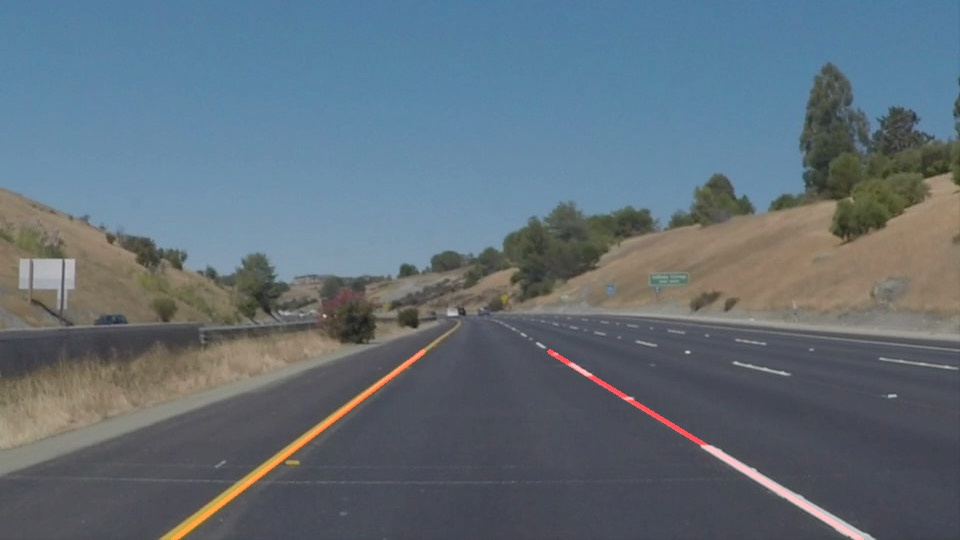| 


This writeup covers the experience I had building the pipeline to transform the original image into the final image, the observations and lessons I've learned, as well as potential opportunities to improve my final results. 

---

## II. The Image Transformation Pipeline

My pipeline consists of seven steps designed to transform an image from its original version to the final output:

- Grayscale transformation
- Kernel convolution to smoothen the image
- Canny Edge Detection
- Identifying a region of interest
- Masking
- Hough transformation to find lines
- Drawing lane lines onto the Original image

**1. Grayscale transformation:** is a process by which (RED, GREEN, BLUE) images are converted into a single channel image, where contrast is increased at pixel-values of interest. To convert our original image to a grayscale image, we use the `cv2.cvtColor(image, cv2.COLOR_RGB2GRAY)` method provided by opencv. Here is the outcome of the grayscale transformation:

Original Image | Step1: Grayscale Transformation
:-------------:|:----------:
| 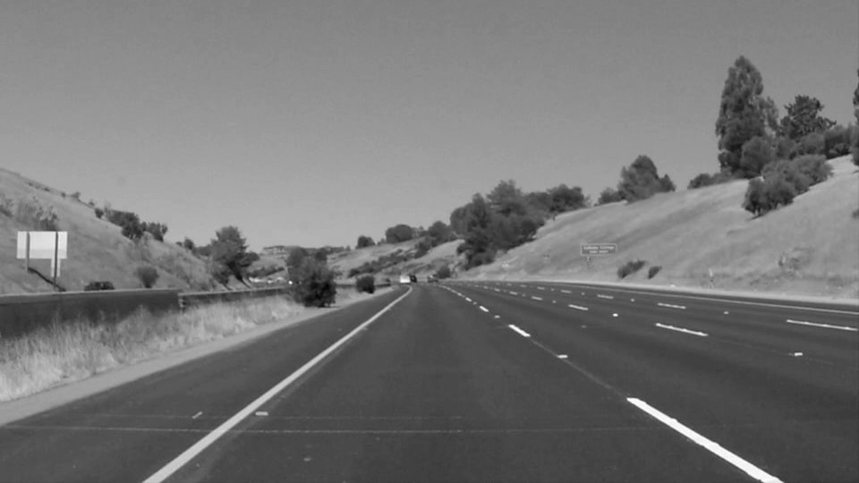


**2. Kernel convolution:** is the process of convolving or overlaying a kernel grid (typically an odd numbered shape, 3x3, 5x5, 7x7, etc) on top of the original image; and replacing each pixel at the center of the kernel with the weighted average between the overlayed zone and the kernel. 
I tried the Gaussian kernel convolution and the Laplacian kernel convolution, to observe different types of transformations. Gaussian blurring is effective if we want to smoothen the image and remove noise that could be captured down the line as edges. The input to the Gaussian blur is the Grayscale transformation output.


Gaussian kernel convolution | Laplacian kernel convolution
:-------------:|:----------:
| 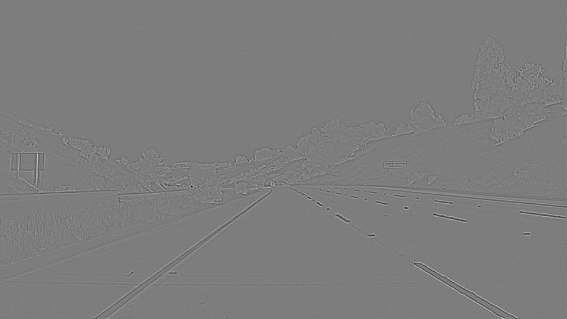


Next, we pass the output of Gaussian Blurring to the Canny Edge Detection method.


**3. Canny Edge Detection:** the Canny edge detector is an edge detection operator that uses multiple stages to detect a wide range of edges in images. It was developed by John F. Canny in 1986. The Process of Canny edge detection algorithm can be broken down to 5 different steps:

1. Apply Gaussian filter to smoothen the image in order to remove the noise
2. Find the intensity gradients of the image
3. Apply non-maximum suppression to get rid of spurious response to edge detection
4. Apply a double threshold to determine potential edges
5. Track edge by ***hysteresis***: finalize the detection of edges by suppressing all the other edges that are weak and not connected to strong edges.

***Note:*** After step2, we have a **Sobel** edge detection. Therefore, Canny edge detection includes Sobel steps, and 3 more: non-maximum suppression to get rid of spurious responses, double threshold to detect potential edges, and hysteresis to suppress all other edges that are between the thresholds and are not connected to strong edges.


Canny edge detection | Sobel x-direction gradients | Sobel y-direction gradient | Final Sobel
:-------------:|:----------:|:--------------------:|:--------------------------:|:----------:
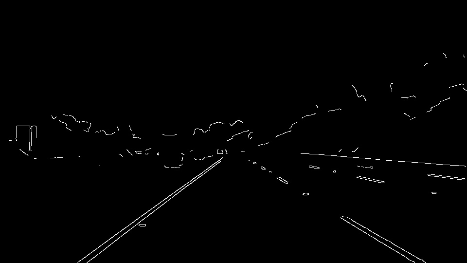| 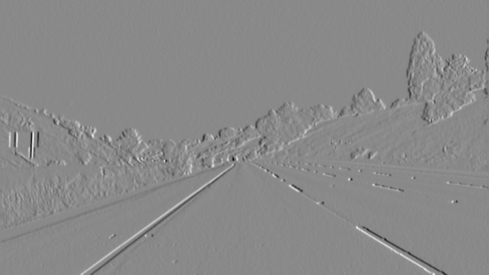 | 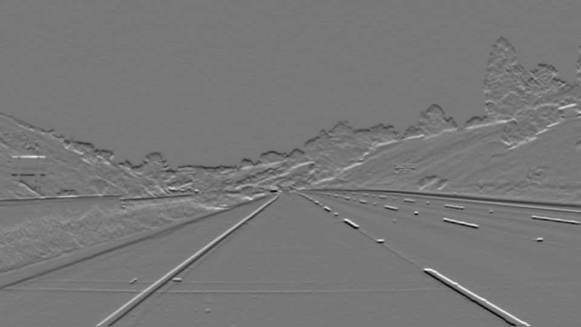 | 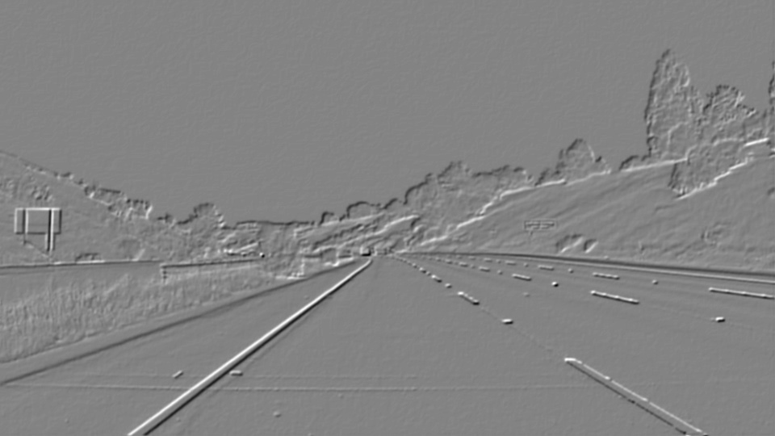


We can see that the Canny method improves edge detection over the Sobel method, by making the edges more explicit and visible. This is achieved by the Canny steps 3 to 5 above. Removing neighboring edges that were found on the gradients but not higher in intensity than the edge pixels identified in the edge traversal direction; and applying a double threshold designed to remove the low edge pixels, and keep weak pixels `connected` to the high pixels (an indicator of a connected edge pixels that could have been weakly captured by the transformations but still part of the same object). 

**4. Region of Interest and masking:**  here we identify the cropped area of the image, which is the triangle with base at the bottom of the image and apex at location `(x/2,y/2)`; then we apply a mask containing our region of interest to the transformed image with detected edges. 

Canny edges | Masked edges
:-------------:|:----------:
| 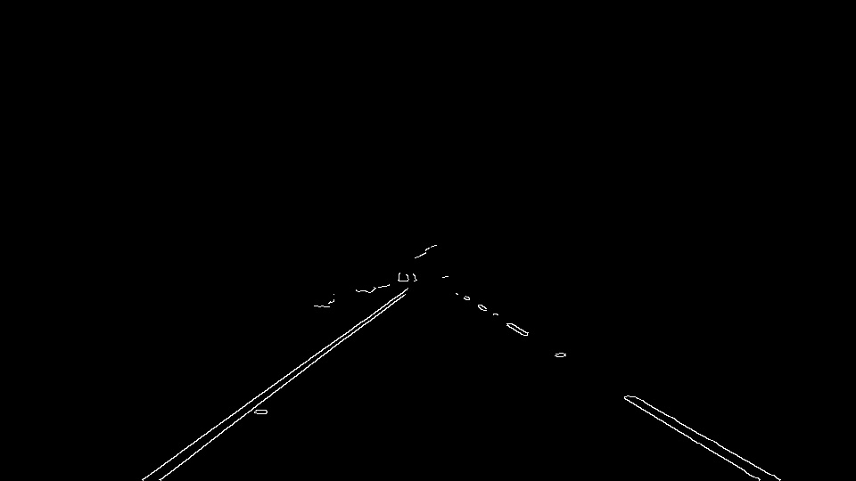


**5. Hough Transformations** project image pixels from the current euclidean $(x,y)$ space onto a polar $(\rho, \theta)$ space where $\rho = x \cos \theta + y \sin \theta$. 

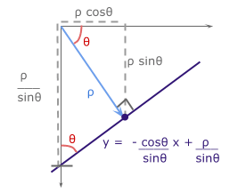

With the projection onto the `hough space`, pixel points are converted into sinusoidal lines, and lines are converted to points of intersection of multiple points in the euclidean space.

<center><b><i>Points to lines</i></b></center>
<br>

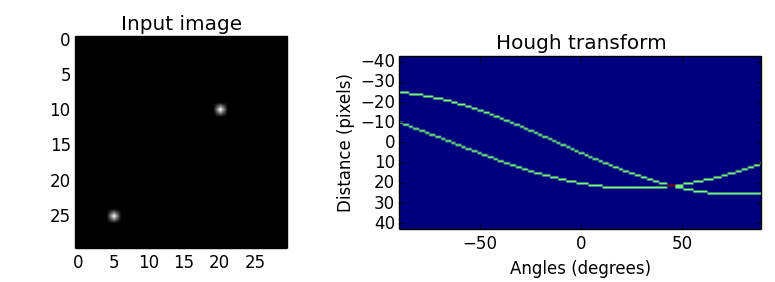


In other words, points that belong to the same line in the $(x,y)$ space correspond to intersecting lines in the $(\rho, \theta)$ space; so finding the points of intersection in the hough space should identify lines after a reverse transformation onto the euclidean space.

<br>
<center><b><i>Lines to points</i></b></center>

<table><tr>
<td> 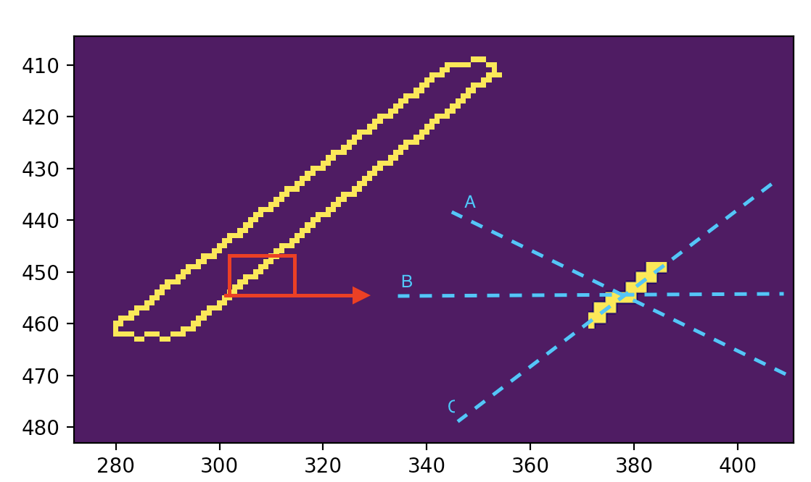 </td>
</tr></table>


After hough transformation on our masked edges image with lines drawn look like this.


<table><tr>
<td> 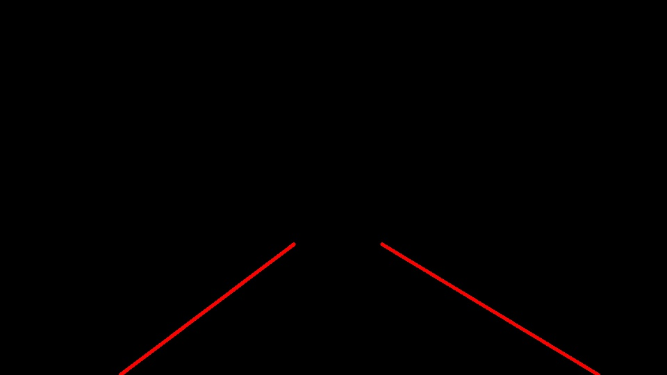 </td>
</tr></table>

**6. Drawing Lanes on the Original Image:** finally, I draw the lines on the original image using the `cv2.addWeighted(initial_img, α, img, β, γ)` method.


<table><tr>
<td>  </td>
</tr></table>

### Draw Lines Improvements

To improve the `draw_lines` in order to find the lanes more accurately, we applied the following approach:

- Identify left and right lines in two groups. Because the `y-axis` faces downwards, a line's slope is positive if it traverses downwards. I created an inner method called `_line_slope(line)` to identify the slope. From finding the slope of lines retuned by the hough transformation, we put the lines into a left of a right group given the slope sign.

```python
# Inner function to find the slope
    def _line_slope(line):
        line = line.reshape(-1)
        x1, y1, x2, y2 = line
        slope = (y2 - y1)/(x2 - x1)
        return slope
    ...
    
    # Line groups for fitting
    x_left = []
    y_left = []
    
    x_right = []
    y_right = []

```

- Fit a curve on the left and right groups of line points. I created an inner method called `_fit_lines(x,y,degree=1)` to do a polynomial curve fitting. The idea with the degree parameter was to test options of having a 2nd or 3rd degree polynomial fit. I was hopping that it would fit well on the curved lines. That didn't work like I planned.

```python
    # Inner function to find the slope and intersect of a linear fit, based on 
    def _fit_lines(x, y, degree=1):
        return np.poly1d(np.polyfit(x,y,degree))
    ...
    # Create a fit as f(y) = x... 
    # Because we want to extract the necessary x_value for the top and botton of the image

    left_fit = _fit_lines(y_left, x_left)
    right_fit = _fit_lines(y_right, x_right)

```


- Given the two fitted curves, I looked for the coordinates of the minimum and maximum x points given the minimum and maximum y points of interest. The y points of interest are given by the area of interest for the lane lines. We want the lines to start at the bottom of the image (i.e maximum y because y is inversed), all the way up to slightly below the middle of the image (in the y-direction). I selected the minimum y at 62% of the maximum y value of the image (which is the first element of `image.shape`).


```python

    ...
    y_max = img.shape[0]
    y_min = int(img.shape[0] * 0.62) # In the middle of the image, aligned with the mask
    
    ...
    
# Getting x values for the left lines
    x_left_min = int(left_fit(y_max))
    x_left_max = int(left_fit(y_min))
        
# Getting x values for the Right lines
    x_right_min = int(right_fit(y_min))
    x_right_max = int(right_fit(y_max))
```


- Finally, I plot solid lines on the image using our fitted x and y values as plotting points.

```python
    cv2.line(img, (x_left_min, y_max), (x_left_max, y_min), color, thickness)
    cv2.line(img, (x_right_min, y_min), (x_right_max, y_max), color, thickness)
```


## III Lessons Learned and Future Improvements

This method could be improved to do a better curve plotting on the curved lanes. My initial hypothesis was to do a curve fitting with a polynomial of degree higher than 1, and use `cv2.polylines` to plot the curve points. Theoretically I think that should work, but my tests didn't converge. The video output test could track the lines better than the original straight lines drawing, but there were also many unstable lines at the bottom of the image.


---

## References

\[1\] Hough transormations images source: https://alyssaq.github.io/2014/understanding-hough-transform/

